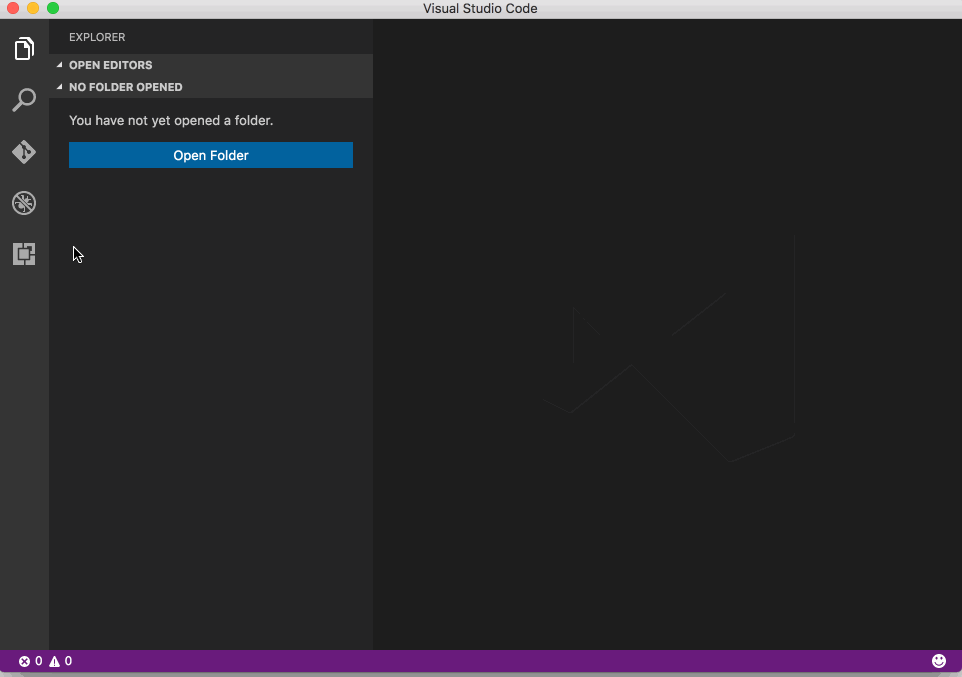
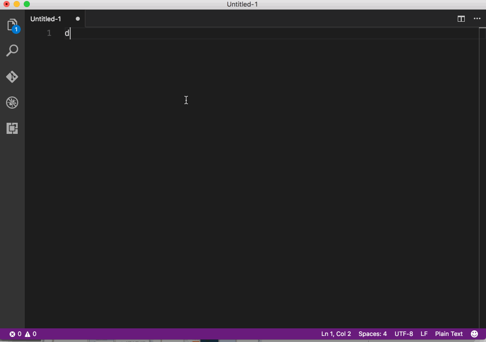
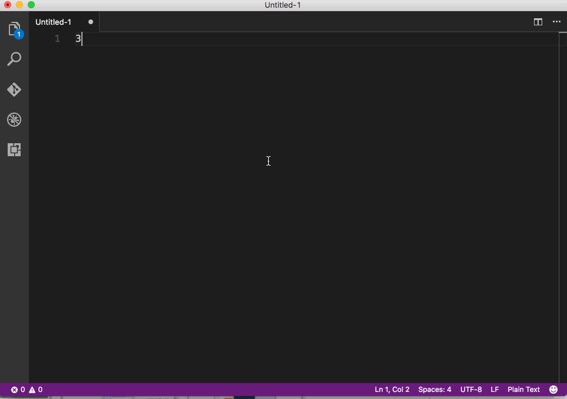

# Functionality

Small tools in Visual Studio Code. The following types of functions are supported:

- `Sort Asc` - Sort selected lines asc
- `Sort Desc` - Sort selected lines desc
- `Trim Lines` - Trim each line
- `Trim And Remove Duplicate Lines` - Trim And Remove Duplicate Lines
- `Compute` - Compute each line of number, sum and average values will be shown.

# Install

1. Open VS Code
2. Go to Extension tab
3. Type "util"
4. Select "vscode-util" to install.

# Usage

1. Open VS Code
2. Select some line texts
3. Press F1 or (cmd+shift+p)
4. Input each command. Such as ("sort", "trim" .. you will see the command)
5. If you use compute, don't need select firstly, but keep a number for each line. Note: non-number line will be ignored during computing.

- Try trim and sort

- Try compute

Market Place: https://marketplace.visualstudio.com/items?itemName=guosong.vscode-util